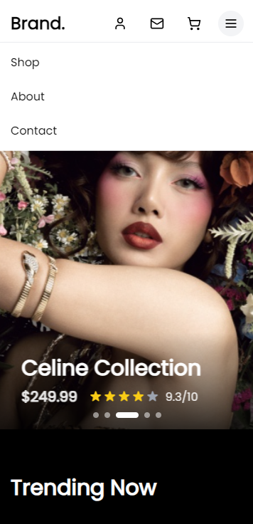
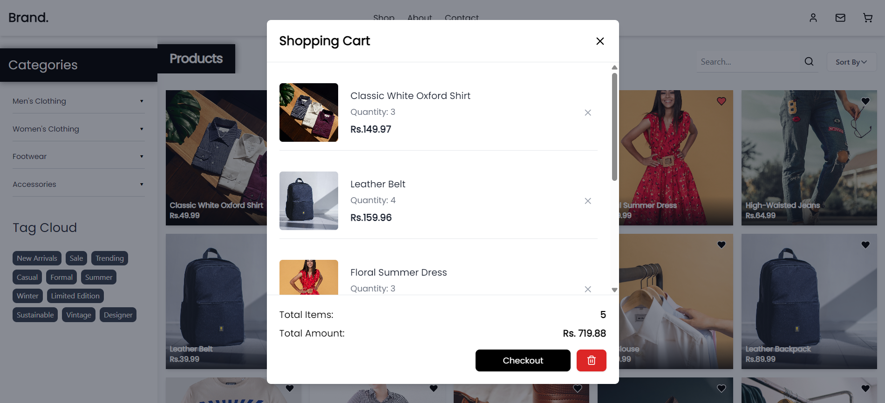
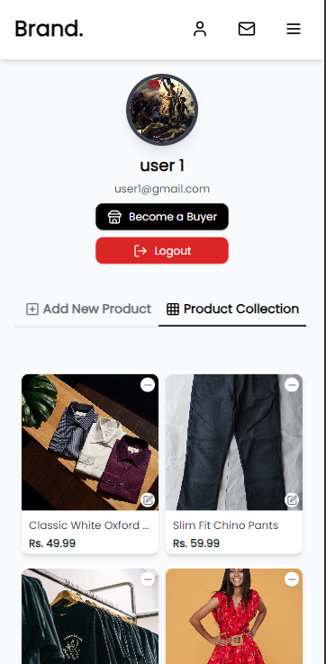

# Fashion E-Commerce Website

A responsive e-commerce platform built with React and Tailwind CSS, featuring a clean design and user-friendly interface.

## 🌟 Features

### 1. UI/UX Design

- Clean and minimalist interface
- Responsive design for all devices
- Custom shadows and visual effects
- Black-themed sections with shadow effects

### Responsive Design

- Mobile-first approach
- Breakpoint-specific layouts
- Adaptive navigation
- Touch-friendly interfaces

### 2. Home Page

- Hero carousel showcasing featured products
- Trending section with black background and shadow effects
- Horizontal product slider
- Recommended products section with decorative dividers

  
  
  
  

### 3. Shop Page

- Categories sidebar with black theme
- Product filtering system
- Product grid with hover effects
- Search functionality
- Sort by options

  
  
  
  

## 4. Shopping Features

- Product filtering
- Search functionality
- Sort options
- Wishlist
- Shopping cart
- Checkout process

  
  
  
  

### 5. User Features

- User authentication
- Profile management
- Wishlist management
- Order history
- Role-based access (Buyer/Seller)

  
  

  
  

### 6. Seller Features

- Product management
- Order management
- Inventory tracking

  
  

## 🛠️ Technical Stack

- **Frontend:**

  - React.js
  - Tailwind CSS
  - Lucide Icons
  - React Router
  - Custom hooks and context

- **Backend:**
  - Node.js
  - Express.js
  - MongoDB
  - JWT Authentication

## 🚀 Getting Started

1. Clone the repository

```bash
git clone [repository-url]
```

2. Install dependencies

```bash
cd FrontEnd
npm install
```

3. Set up environment variables

```bash
cp .env.example .env
```

4. Start the development server

```bash
npm run dev
```

## 📁 Project Structure

```
├── FrontEnd/
│   ├── src/
│   │   ├── components/
│   │   ├── pages/
│   │   ├── store/
│   │   ├── dataFile/
│   │   └── App.jsx
│   ├── public/
│   └── package.json
└── Backend/
    ├── src/
    │   ├── controllers/
    │   ├── models/
    │   ├── routes/
    │   └── server.js
    └── package.json
```

## 🎨 Design Features

### Visual Effects

- Black background sections with custom shadows
- Hover animations on product cards
- Smooth transitions for category menus

## 🔒 Security Features

- JWT Authentication
- Protected Routes
- Secure API endpoints
- Input validation

## 👥 User Roles

### Buyer

- Browse products
- Add to wishlist
- Place orders
- Track orders
- Manage profile

### Seller

- Manage products
- Track orders
- Manage inventory
- Update profile

## Made in Collaboration by:

Anjan Shrestha & Aayush Kakshapati

## 📄 License

Copyright © 2024 Anjan Shrestha & Aayush Kakshapati. All rights reserved.

This project is licensed under the MIT License - see the [LICENSE](LICENSE) file for details.

### Legal Notice

This software and its documentation are protected by copyright law. Unauthorized copying, distribution, or use of this software, via any medium, is strictly prohibited. All rights are reserved by the copyright holders.

For licensing inquiries, please contact:

- Anjan Shrestha
- Aayush Kakshapati
